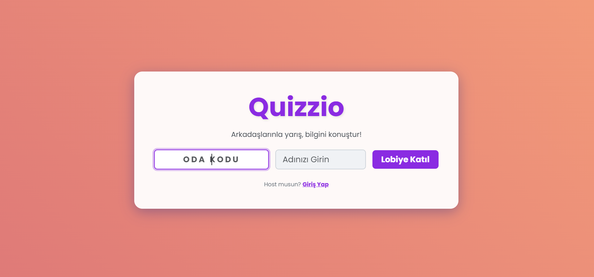
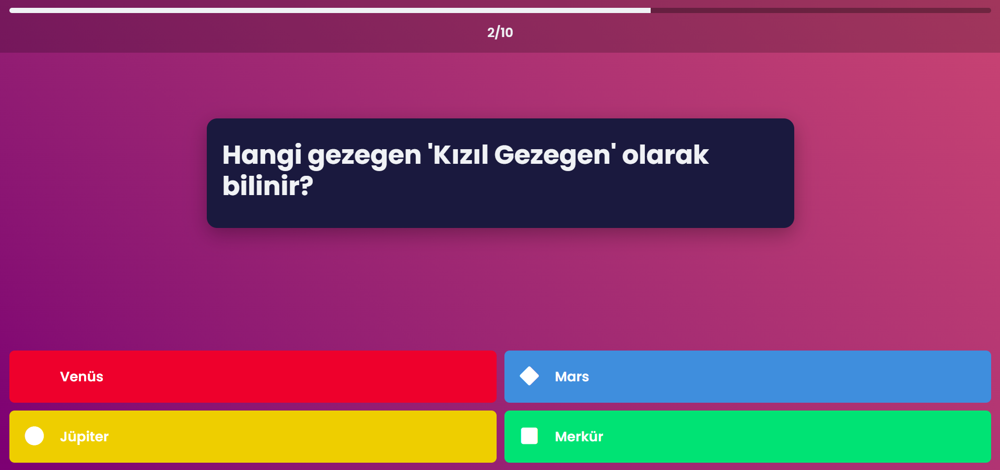
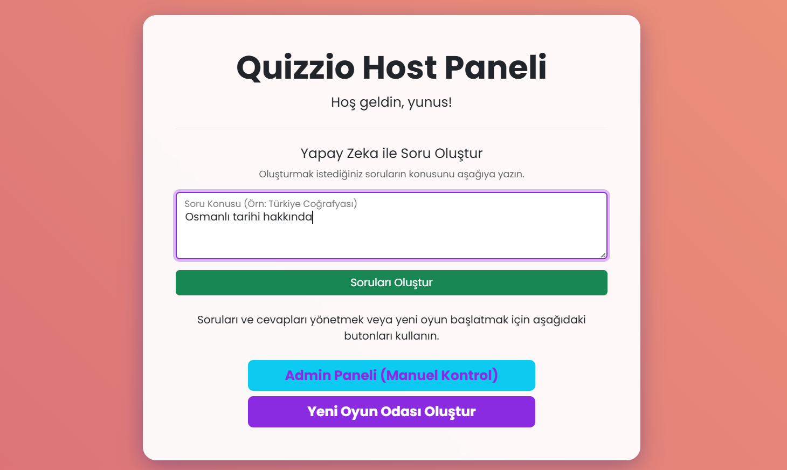
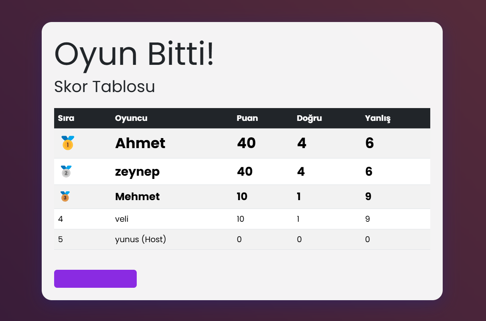

# 🚀 Quizzio: Gerçek Zamanlı ve Etkileşimli Bilgi Yarışması Platformu


**Quizzio**, Kahoot benzeri bir deneyim sunan, yerel ağ üzerinde çalışan, çok oyunculu ve gerçek zamanlı bir bilgi yarışması uygulamasıdır. Projenin en ayırt edici özelliği, **Üretken Yapay Zeka (Google Gemini)** entegrasyonu sayesinde, host'un belirlediği herhangi bir konuda saniyeler içinde benzersiz ve özgün soru setleri oluşturabilmesidir.

Bu proje, Django ve Vue.js kullanarak modern, decoupled (ayrık) bir tam kapsamlı (full-stack) web uygulamasının nasıl geliştirilebileceğini göstermek amacıyla inşa edilmiştir.

---

## 🖼️ Ekran Görüntüleri

*(Bu kısımları kendi aldığınız ekran görüntüleriyle güncelleyebilirsiniz.)*

| Ana Sayfa & Lobi | Oyun Ekranı |
| :---: | :---: |
|  |  |
| **Yapay Zeka Soru Üretimi** | **Skor Tablosu** |
|  |  |

---

## ✨ Temel Özellikler

* **Gerçek Zamanlı Çok Oyunculu Deneyim:** WebSocket (Django Channels) sayesinde tüm oyuncular için senkronize bir oyun akışı.
* **Yapay Zeka Destekli Soru Üretimi:** Host, istediği bir konu başlığı girerek Google Gemini API aracılığıyla anında 10 soruluk benzersiz bir quiz oluşturabilir.
* **Ayrık (Decoupled) Mimari:** Django (Backend) ve Vue.js (Frontend) projelerinin bağımsız olarak geliştirilmesi.
* **Modern Frontend:** Vue.js ile oluşturulmuş, hızlı ve reaktif bir Tek Sayfa Uygulaması (SPA).
* **Asenkron Görev Yönetimi:** Celery ve RabbitMQ ile yönetilen zamanlayıcılar ve oyun akışı sayesinde kesintisiz bir kullanıcı deneyimi.
* **Host Kontrol Paneli:** Host'un oyunu başlatması ve yapay zeka ile soru üretmesi için özel bir arayüz.
* **Kolay Katılım:** Oyuncuların sadece 4 haneli oda kodu ve isimle anında lobiye katılabilmesi.
* **Dinamik Skor Tablosu:** Oyun sonunda en yüksek puandan en düşüğe doğru sıralanmış, detaylı sonuç ekranı.

---

## 🛠️ Teknoloji Mimarisi

Proje, modern ve ölçeklenebilir bir teknoloji yığını üzerine kurulmuştur.

### Backend Mimarisi
| Teknoloji | Amaç |
| :--- | :--- |
| **Python** | Ana programlama dili. |
| **Django** | Güçlü ve güvenli web framework'ü, API sunucusu. |
| **Django Channels** | WebSocket desteği ile gerçek zamanlı iletişimi sağlar. |
| **Daphne** | Django Channels için yüksek performanslı ASGI sunucusu. |
| **Celery** | Zamanlanmış ve uzun süren görevleri (geri sayım, YZ sorgusu) arka planda yönetir. |
| **RabbitMQ** | Celery için mesaj kuyruğu (Message Broker). |
| **Redis** | Channels için "Channel Layer" ve Celery için sonuç deposu. |
| **Google Gemini API** | Host'un verdiği komutla dinamik sorular üretir. |

### Frontend Mimarisi
| Teknoloji | Amaç |
| :--- | :--- |
| **Vue.js** | Modern ve reaktif kullanıcı arayüzleri oluşturmak için kullanılan JavaScript framework'ü. |
| **Vite** | Hızlı geliştirme sunucusu ve modern build aracı. |
| **Vue Router** | Tek Sayfa Uygulaması (SPA) içinde sayfalar arası geçişi yönetir. |
| **Pinia** | Merkezi durum yönetimi (State Management) için kullanılır. |
| **Bootstrap** | Temel grid yapısı ve bazı bileşenler için kullanılır. |
| **CSS3** | Hareketli arkaplan, "camsı" kartlar ve özel tema için kullanılır. |

---

## 🚀 Kurulum ve Başlatma

Projeyi yerel makinenizde çalıştırmak için aşağıdaki adımları izleyin.

### Gereksinimler
* Python 3.10+
* Node.js 18+
* RabbitMQ Sunucusu (çalışır durumda)
* Redis Sunucusu (çalışır durumda)

### 1. Projeyi Klonlama
```bash
git clone [https://github.com/kullanici-adiniz/Quizzio-Yunusyamann-Quizzio-Gercek-Zamanli-Bilgi-Yarimasi-Platformu.git)
cd Quizzio-Yunusyamann-Quizzio-Gercek-Zamanli-Bilgi-Yarimasi-Platformu
```

### 2. Backend Kurulumu
```bash
# Ana proje dizinindeyken
# 1. Sanal ortam oluşturun ve aktif edin
python -m venv venv
# Windows:
venv\Scripts\activate
# macOS/Linux:
# source venv/bin/activate

# 2. Gerekli Python paketlerini yükleyin
pip install -r requirements.txt

# 3. Google Gemini API Anahtarınızı ekleyin
# quiz_project/settings.py dosyasını açın ve en altına anahtarınızı ekleyin:
# GEMINI_API_KEY = 'SIZIN_API_ANAHTARINIZ'

# 4. Veritabanını oluşturun
python manage.py migrate

# 5. Host kullanıcısını oluşturun
python manage.py createsuperuser
```

### 3. Frontend Kurulumu
```bash
# Frontend klasörüne gidin
cd frontend

# Gerekli Node.js paketlerini yükleyin
npm install
```

### 4. Geliştirme Ortamını Çalıştırma
Projeyi çalıştırmak için **3 ayrı terminal** açmanız gerekmektedir.


Artık tarayıcınızdan `http://localhost:5173` adresine giderek **Quizzio**'yu kullanmaya başlayabilirsiniz!

---

## ✍️ Geliştirici

* **Yunus YAMAN** - (https://www.linkedin.com/in/yunus-yaman/)
